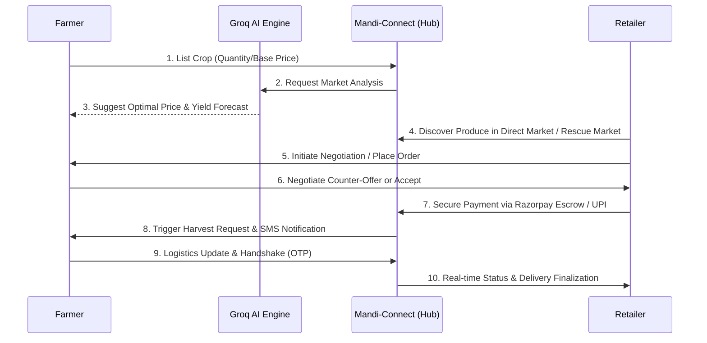
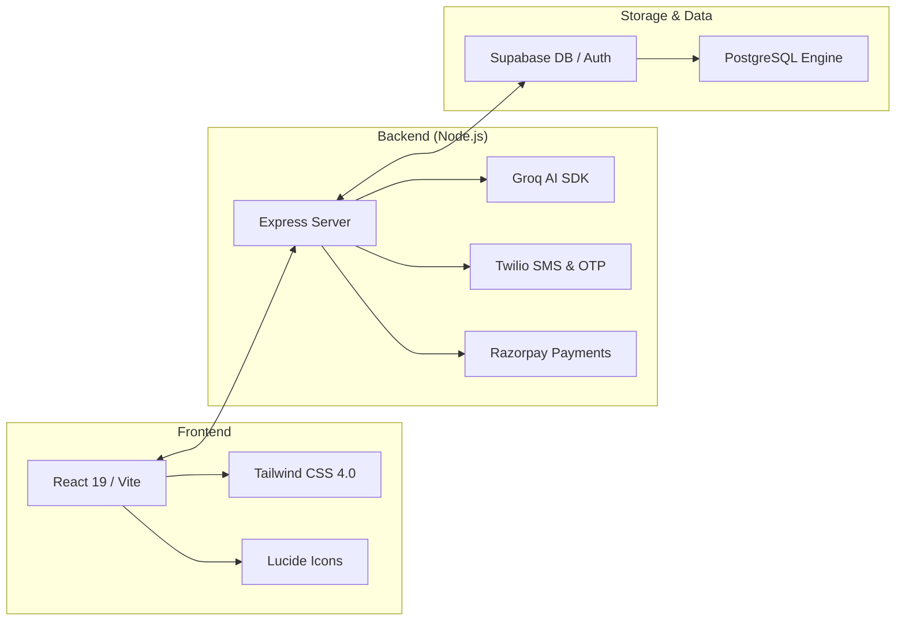

# Mandi-Connect 🌾

[](https://vitejs.dev/)
[](https://reactjs.org/)
[](https://supabase.io/)
[](https://tailwindcss.com/)
[](https://nodejs.org/)

> **Connecting the Roots to the Retailers.** A high-performance, mobile-first, and AI-powered marketplace designed for rural India.

Mandi-Connect is a comprehensive platform that streamlines the supply chain from the farmer's field to the retailer's shop. It leverages modern technologies like **Supabase**, **React 19**, and **Groq AI** to provide a seamless, reliable, and intelligent experience for the agriculture sector.

---

## 💡 Executive Summary (The "Why")

### ❌ The Problem
Traditional agricultural supply chains are highly fragmented. Farmers rely heavily on middlemen who drastically cut into their profits, and a lack of real-time data leaves them guessing on harvest pricing. Additionally, tons of produce go to waste simply because farmers cannot find buyers before their crops spoil.

### ✅ Our Solution
**Mandi-Connect** is a high-performance B2B marketplace engineered to completely eliminate the middleman. By directly connecting farmers to retailers, providing AI-driven price predictions, and introducing a first-of-its-kind **Spoilage Rescue** feature, we increase farmer revenues, provide retailers with fresher produce, and drastically reduce agricultural food waste.

---

## 🚀 Platform Modules

The Mandi-Connect UI is streamlined into four core branded sections:
- **Price Predictor**: AI-powered dashboard for harvest yield predictions and historical market pricing forecasts.
- **Rescue Market**: A dedicated Spoilage Rescue marketplace to quickly list and sell soon-to-spoil produce at discount prices, preventing food waste.
- **Direct Market**: The primary marketplace for fresh produce where seamless local connections and real-time negotiations take place.
- **My Farm**: The central hub for farmers to manage their listings, monitor active orders, and track fulfillment requirements.

---

## 🚀 What's New in v2.0

We've completely overhauled the platform to offer a truly premium experience:
- **Full React Migration**: Rebuilt from vanilla scripts to a modern **Vite + React 19** architecture for lightning-fast interactions.
- **AI Price & Crop Predictor (Price Predictor)**: Integrated **Groq-powered models** to help farmers predict harvest yields and market prices.
- **Advanced Negotiation Workflow**: A new counter-offer system allowing farmers and retailers to haggle in real-time.
- **Spoilage Rescue System (Rescue Market)**: Dedicated feature to list and sell close-to-expiry produce, drastically reducing food waste.
- **Trust & Verification**: Retailer trust scores with a robust OTP handshake verification during final crop delivery/fulfillment.
- **Twilio Hybrid Notifications**: A reliable dual-layer communication system featuring Twilio SMS alerts and an in-app notification inbox.
- **Secure Onboarding**: Razorpay integration for escrow payments and farmer onboarding features.
- **Raitha Mithra (Voice AI)**: A context-aware, voice-enabled multi-lingual AI assistant helping users navigate and manage their business directly via voice commands.

---

## ✨ Key Features

### 🚜 For Farmers
- **Smart Listings**: Effortlessly list crops with photos and detailed specs on **My Farm**.
- **Negotiation Dashboard**: Manage offers, counter-offers, and finalized deals in one place.
- **AI Analytics**: Forecast market trends and decide the best time to sell using the **Price Predictor**.
- **Fulfillment Tracking**: View a unified daily pick-list for harvests and track incoming pickups using an order handshake verification mechanism via OTPs.

### 🏪 For Retailers
- **Dynamic Marketplace (Direct Market)**: Search and filter fresh produce from verified local farmers.
- **Bulk & Rescue Orders**: Place high-volume orders or buy heavily discounted, time-sensitive goods from the **Rescue Market**.
- **Secure Escrow Payments**: Integrated Razorpay onboarding and UPI secure payments that process funds to an escrow system to guarantee trust between parties.
- **Order Tracking**: Real-time status updates from harvest selection to final delivery.

### 🌐 Core Engine
- **Multilingual Support**: Fully translated out of the box in **English, Hindi, and Kannada**, allowing farmers to engage in their native tongue.
- **Raitha Mithra AI Assistant**: A voice-controlled AI chatbot that understands current user context (active crops, pending orders) and offers spoken guidance in regional languages.
- **Real-time Notifications**: Hybrid system using Twilio SMS alerts combined with a built-in app notification inbox.
- **Offline-First PWA**: Reliable performance even in low-bandwidth rural areas via IndexedDB caching.

---

## 🔄 Working Flow

Experience the seamless journey from farm to market:



### The Order Pipeline
1. **Smart Listing**: Farmer adds crops; **Groq AI** provides real-time pricing guidance.
2. **Discovery & Deal**: Retailer finds crops in the Direct or Rescue Market and starts a **real-time negotiation**.
3. **Escrow Transaction**: Once agreed, the Retailer deposits funds into a **secure Escrow via Razorpay/UPI**.
4. **Tracked Fulfillment**: Farmer manages harvest via daily pick-lists, delivers, and verifies the handover via **OTP verification**.
5. **Payout**: Automatically transfers funds from Escrow to the Farmer.

---

## 🛠️ Technical Architecture



---

## 💻 Tech Stack & Business Impact

| Category | Technology | Why We Used It (Real-World Impact) |
| :--- | :--- | :--- |
| **Frontend Framework** | React 19 (Vite) | Delivers a blazing-fast, app-like experience crucial for users on low-end mobile devices. |
| **Styling** | Tailwind CSS 4.0 | Ensures a highly polished, responsive UI that builds trust with non-technical users. |
| **Backend Runtime** | Node.js / Express | Provides a highly scalable architecture capable of handling thousands of concurrent orders. |
| **Database & Auth** | Supabase (PostgreSQL) | Guarantees secure authentication and real-time data sync for live negotiation updates. |
| **AI Integration** | Groq SDK (Llama Models) | Powers lightning-fast market price forecasts and the intelligent conversational voice agent. |
| **Notifications** | Twilio API | Ensures farmers receive critical order updates via SMS, even without an active internet connection. |
| **Payments** | Razorpay / UPI Intent | Builds platform trust through secure Escrow payments and automated seamless payouts. |

---

## 🛠️ Installation & Setup

### Prerequisites
- Node.js (v18+)
- Supabase Account & Project
- Twilio & Razorpay API credentials
- Environment Variables Setup

### 1. Initialize the Backend
```bash
cd backend
npm install
# Configure your .env with SUPABASE_URL, SUPABASE_KEY, TWILIO_SID, RAZORPAY_KEY, etc.
npm start
```
The API server will be available at `http://localhost:3001`.

### 2. Launch the Frontend
```bash
cd frontend-react
npm install
npm run dev
```
The application will open at `http://localhost:5173`.

---

## 📁 Project Structure

```text
Mandi-Connect/
├── frontend-react/      # Modern React Application (Active)
│   ├── src/pages/       # Dashboards, AiPredictor, SpoilageRescue, Marketplace, Fulfillment
│   ├── src/components/  # Layout, NotificationCenter, ProtectedRoute
│   ├── src/services/    # Axios API Integrations
│   └── src/i18n.js      # English, Hindi, Kannada Translations
├── backend/             # Node.js API Service
│   ├── index.js         # API Core Setup
│   ├── routes/          # Express route definitions (OTP, Auth, Crops, Spoilage, Notifications, etc.)
│   └── services/        # AI, SMS Notifications, and Database logic
└── frontend/            # Older Vanilla JS Version (Legacy)
```

---

## 🤝 Contributing

We welcome contributions to make agriculture more efficient!
1. Fork the Project
2. Create your Feature Branch (`git checkout -b feature/AmazingFeature`)
3. Commit your Changes (`git commit -m 'Add some AmazingFeature'`)
4. Push to the Branch (`git push origin feature/AmazingFeature`)
5. Open a Pull Request

---

## 📜 License

Distributed under the **MIT License**. See `LICENSE` for more information.

Built with ❤️ for **Hackathon Demo 🏆** | © 2026 Mandi-Connect
